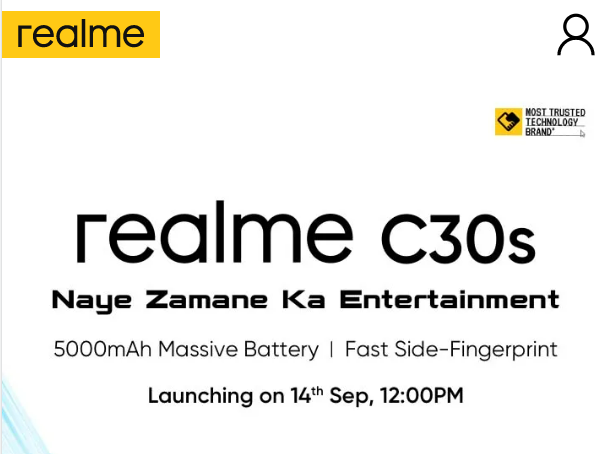

# FSJS Dom Manipulation Assignment

1. Webiste Name: [Dev To](https://dev.to/)

### Topics

    - Query Selctory, Inner HTML

### Sample Image

### Tasks

    Target the Top description div and change the DEV Community to <Your_Name> and description to your passion

### Code

    document.querySelector(".crayons-card .crayons-subtitle-2").innerHTML = "Rohit Narayan Chandani"
    document.querySelector(".color-base-70").innerHTML = "Coding, Dancing, solving Rubik´s cube"

### Output

2. Website Name: [Apple](https://support.apple.com/en-in)

### Task

### Fetch all the product name and store in an array

### Code
    let storeArray = [];
    let appleList = document.querySelectorAll(".as-imagegrid-item");
    for (let apple of appleList) {
          storeArray.push(apple.innerText);
    };
    console.log(storeArray);

### Output

['iPhone', 'Mac', 'iPad', 'Watch', 'AirPods', 'Music', 'TV']

3. Webiste Name: [Youtube Support](https://support.google.com/youtube/)

### Topics

    - Get Element By Id, Create Element, Create Text Node, Append Child

### Sample Image

### Tasks

     Add another FAQ 'My New FAQ' to the list

### Code

     let newCard = document.querySelector(".accordion-homepage"); 
     let faqList = document.createElement("section"); 
     faqList.className = "parent"; 
     faqList.appendChild(document.createElement("h3")); 
     faqList.querySelector("h3").textContent = "My New Faq"; 
     newCard.appendChild(faqList);

### Output

4. Webiste Name: [OnePlus](https://www.oneplus.in/support)

### Topics

     Query Selector, InnerText

### Sample Image

### Tasks

      Change the contact number

### Code

     document.querySelector(".content-m .item--subtitle").innerHTML = "+91 6366256689"

### Output

5. Webiste Name: [Samsung](https://www.samsung.com/in/offer/online/samsung-fest/)

### Topics

       getElementById, createElement, InnerText, append, setAttribute

### Sample Image

### Tasks

     Target the main div of card and change the Button text to Check out

### Code

     document.querySelector(".feature-column-carousel__button .cta").innerText = "Check Out"

### Output

6. Webiste Name: [Adidas](https://www.adidas.co.in/)

### Topics

    -   Query Selector, Event listeners, Changing Styles

### Sample Image

### Tasks

     Target the search box and on hover change thebackground color to red.

### Code

     let search = document.querySelector("._input_1f3oz_13");
     search.addEventListener("mouseover", rohit);
     function rohit() {
        search.style.backgroundColor = "red";
     };

### Output

7. Webiste Name: [MDN Web Docs](https://developer.mozilla.org/en-US/)

### Topics

       Form, Value, Submit

### Sample Image

### Tasks

     To Search a topic in the MDN Search bar.
     First add a text to search in the search bar and then hit the submit search button to search the docs using DOM

### Code

    function searchBar(i){
    let inputValue = document.querySelector(".search-input-field");
    inputValue.value = i;
    let form = document.querySelector(".search-form");
    form.submit();
    }
    searchBar("CSS Selector"); 

### Output

8. Webiste Name: [Google](https://www.google.com/)

### Topics

       Remove Elements

### Sample Image

### Tasks

     Remove alternate languages from the home page languages listed

### Code

     let element = document.querySelectorAll("#SIvCob a");
     let newArray = [];
     for(let i = 0; i < arr.length; i++){
     if(i % 2 == 0){
         newArray.push(element[i].remove());
        }
     };

### Output

9. Webiste Name: [Code Wars](https://www.codewars.com/)

### Topics

       Change Font Family, Color of Text.

### Sample Image

### Tasks

    Change the font family of the text to monospace and text color to the logo’s background color.

### Code

    document.querySelector(".text-color-white").style.fontFamily = "monospace"
    document.querySelector(".text-color-white").style.color = "red"

### Output

10. Webiste Name: [Freecodecamp](https://www.freecodecamp.org/)

### Topics

       querySelector, mouseover, click eventListener,  callback function, style,

### Sample Image

### Tasks

    Target the button and change background colour on mouseover

### Code

    document.querySelector(".col-lg-8 .login-btn-text")
    .addEventListener("mouseover", function rohit() 
    {document.querySelector(".col-lg-8 .login-btn-text").style.backgroundColor = "red";});

    <!-- or  -->

    let button = document.querySelector(".col-lg-8 .login-btn-text");
    button.addEventListener("mouseover", rohit);
    function rohit() {
      document.querySelector(".col-lg-8 .login-btn-text").style.backgroundColor = "red";
    };

    <!-- or -->
     
    const btn = document.querySelector('.col-lg-8 .login-btn-text');
    btn.addEventListener('mouseover', () => {
    document.querySelector('.col-lg-8 .login-btn-text').style.backgroundColor = 'red';
    });

### Output

11. Webiste Name: [realme](https://www.realme.com/in/)

### Topics

       querySelector,style,background-image

### Sample Image

### Tasks

    change the realme logo to ineuron logo

### Code
  
    document.querySelector(".header .wrapper .logo .icon").style.backgroundImage = "url('https://ineuron.ai/images/ineuron-logo.png')";

### Output

12. Webiste Name: [Github](https://github.com/)

### Topics

       querySelector,style,background-Color

### Sample Image

### Tasks

     change the background colour of the button to blue.

### Code

     document.querySelector(".btn").style.backgroundColor = "blue";

### Output

13. Webiste Name: [Hackerrank](https://www.hackerrank.com/)

### Topics

       querySelector,innerHtml

### Sample Image

### Tasks

    Target the top description and change “Matching developers with great companies” to ‘JSBOOTCAMP“.

### Code

    document.querySelector(".home22-intro-content .home22-intro-title").innerHTML = "JSBOOTCAMP";

### Output

14. Webiste Name: [Asus](https://www.asus.com/in/)

### Topics

      querySelector,style,font-size

### Sample Image

### Tasks

     change the fontsize of “Hot Deals” to 80px

### Code

     document.querySelector(".HotDealsAll__HotCampaignsEventsContainer__FK0V2 .HotDealsAll__Heading__2fIbe").style.fontSize = "80px"

### Output

15. Webiste Name: [Dell](https://www.dell.com/en-in/shop/deals/laptop-deals?gacd=10415953-9016-5761040-285981356-0&dgc=ST&gclid=Cj0KCQjwguGYBhDRARIsAHgRm4-XUDMhhVNyHXb3s1gY4ZBzORr_d9Se-buhJwy7asyUe7YdqEA11eEaAt6UEALw_wcB&gclsrc=aw.ds&nclid=BxjBlpBQsX6pjSHh-L8YYSU77EpfXRkG1AGMB5Wbeu386ykspfrPDnfx_DdFau20)

### Topics

      querySelector,style.textAlign

### Sample Image

### Tasks

       Convert the text “G15 Gaming Laptop” from left to right

### Code

     document.querySelector(".ps-title").style.textAlign = "right";

### Output

16. Webiste Name: [Vercel](https://vercel.com/)

### Topics

     querySelector,innerHTMl

### Sample Image

### Tasks

      change the heading “Start with the developer” to “Start with Scratch”

### Code

     document.querySelector(".geist-wrapper .jsx-499702677 .section-title_title__VEDfK").innerHTML = "Start with Scratch"

### Output

17. Webiste Name: [Sony](https://www.sony.co.in/)

### Topics

    querySelector,innerHTMl

### Sample Image

### Tasks

     change the button text To current Date.

### Code
 
     document.querySelector(".btn-container").innerHTML = Date();

### Output

18. Webiste Name: [Philips](https://www.philips.co.in/)

### Topics

     querySelector,style,backgroundcolor

### Sample Image

### Tasks

    change the background colour blue to orange

### Code

    document.querySelector(".p-footer").style.backgroundColor = "orange"

### Output

19. Webiste Name: [Canon](https://in.canon/)

### Topics

          querySelector,src

### Sample Image

### Tasks

    extract the canon logo

### Code
 
    document.querySelector(".p-header__head--brand .p-header__head--brand-link .p-header__head--brand-image").src

### Output

20. Webiste Name: [Oppo](https://www.oppo.com/in/)

### Topics

          querySelector,style,color

### Sample Image

### Tasks

      Change the description colour black to orange

### Code

      document.querySelector(".section-box .desc").style.color = "orange"

### Output

